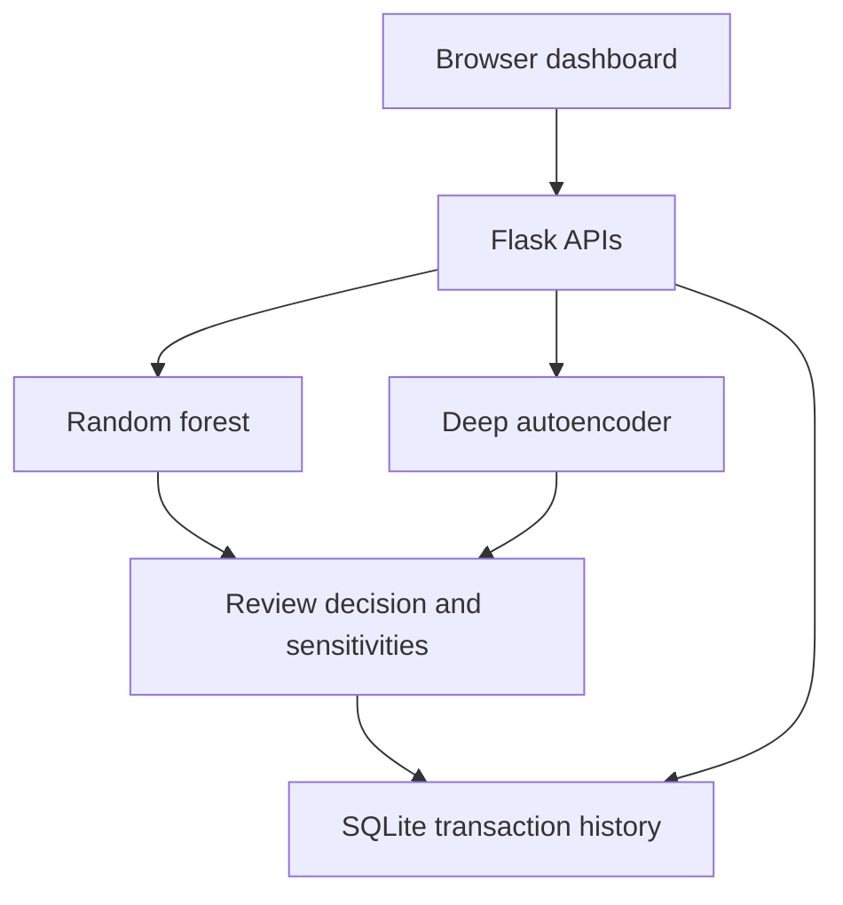

# FraudLens — Explainable Transaction Risk Studio

A working full-stack Flask application combining a random forest fraud classifier with a deep neural autoencoder for unusual transaction behaviour. Responsive HTML/CSS/JavaScript dashboard, REST APIs, SQLite persistence, CSV batch scoring, analyst feedback, and reproducible model evaluation.

**Status:** working synthetic-data prototype. GitHub source is available; a public Flask deployment requires a Python hosting service. This is not validated on real financial transactions.

## Run on Mac M1 / Linux

Python 3.11 or 3.12 recommended. From this folder:

```bash
python3 -m venv .venv
source .venv/bin/activate
python -m pip install -r requirements.txt
python train.py
python app.py
```

Open http://127.0.0.1:5000. Training creates trusted local model artifacts; they are excluded from Git. Retrain after changing scikit-learn versions. No external APIs or API keys needed.

## Demo in 90 seconds

1. Score the everyday payment preset.
2. Score the suspicious preset; compare classifier score and neural reconstruction error.
3. Change distance or transaction velocity and rescore.
4. Read the feature replacement sensitivities; distinguish sensitivity from causality.
5. Mark an outcome as legitimate or fraud; refresh the persistent review queue.
6. Upload `sample_transactions.csv`.
7. Discuss held-out metrics and the cost of false positives versus false negatives.

## Architecture



Six features: amount, hour, distance from usual location, transactions in one hour, account age, and new-device indicator. This prototype receives these precomputed signals; it does not calculate them from customer histories.

The autoencoder is a genuine neural network implemented with scikit-learn's `MLPRegressor`, not PyTorch/TensorFlow: **6 → 16 → 8 → 3 → 8 → 16 → 6**, tanh hidden layers and squared reconstruction loss. It learns legitimate training examples only. StandardScaler is fit on legitimate training records. The bottleneck compresses input into three dimensions. A validation legitimate-error 95th percentile determines the anomaly cutoff.

The classifier uses balanced class weights. Its threshold minimizes validation `FP + 5*FN`. Review is recommended when the classifier crosses its threshold **or** the autoencoder flags an anomaly. Neither model automatically blocks payments.

Local explanations replace each input individually with its training median and measure the score change. They are model sensitivities, not SHAP values, causal evidence, or additive attributions. Classifier probability estimates are not calibrated.

## Evaluation

6,000 deterministic synthetic transactions; stratified 60/20/20 training/validation/test. Labels are sampled from an overlapping probabilistic process, so perfect accuracy is neither expected nor claimed. See `models/metrics.json` for measured results. Classifier test PR-AUC is approximately **0.340**, versus a **0.090** prevalence baseline; ROC-AUC approximately **0.779**. Precision approximately **0.341**, recall **0.426** at the chosen threshold. These scores describe only this synthetic distribution and the classifier, not real-world performance or the combined review policy.

The autoencoder's initial 180-iteration training reached its iteration limit with a convergence warning. It is usable for the demo, but reconstruction loss and training stability need tuning before stronger claims. Feature schemas and splits must be redesigned when using real data. Test labels are never used for threshold selection.

## API

| Method | Route | Purpose |
|---|---|---|
| GET | `/api/health` | Loaded-model health |
| GET | `/api/metrics` | Model evaluation |
| POST | `/api/predict` | Validate, score, save transaction |
| POST | `/api/batch` | Multipart CSV, 1–500 rows, 1 MB maximum |
| GET | `/api/transactions` | Latest 200 records |
| POST | `/api/transactions/<id>/feedback` | Save `fraud` or `legitimate` label |

Prediction JSON example:

```json
{"amount":350,"hour":14,"distance_km":3,"transactions_1h":1,"account_age_days":800,"device_new":0}
```

CSV feature names must match `sample_transactions.csv`. Invalid batches make no database changes. Feedback is stored for later analysis and is never automatically treated as training truth. Dashboard counters cover the latest 200 records.

## Tests

```bash
python -m pytest tests -q
node --check static/app.js
```

11 backend tests passed during creation: validation, deterministic inference, persistence, feedback, routes, and atomic batch rejection. JavaScript syntax checked. Browser layout/interaction and Docker deployment have not been verified in this environment.

## Deploy with Docker

```bash
docker build -t fraudlens .
docker run --rm -p 5000:5000 fraudlens
```

Gunicorn serves Flask; training runs during image build. Docker is supplied but was not built here. For Render, create a Docker web service from `Parulshuklaa/PROJECTS`, with root directory `fraudlens`; health path `/api/health`. No hosting account is connected yet. Hosting may incur costs; choose the plan yourself. SQLite in ephemeral hosting is reset during redeploy unless a persistent disk or database is configured. A persistent volume can be mounted and `FRAUDLENS_DB` set to its database path. This demo has no authentication and shared analyst state: use synthetic records only. Before production, add identity/access controls, CSRF protection when cookie sessions are introduced, rate limits, audit trails, PostgreSQL, and monitoring.

## What makes this worth discussing in interviews

- Why PR-AUC is more useful than accuracy on imbalanced data.
- Why anomaly detection and supervised fraud classification solve different problems.
- Why validation selects thresholds, while held-out test estimates performance.
- How false-positive costs change operational review volume.
- Why input validation, database transactions, and feedback quality matter.
- How to extend this into temporal evaluation, calibrated scores, drift monitoring, and safe retraining.

## Honest next steps

A generated project alone will not make you stand out. Understand every module, implement a meaningful extension yourself, evaluate a real licensed dataset using its actual feature schema, compare against logistic regression, and document failures. Never claim production fraud detection, SHAP explanations, PyTorch, or real banking data from this prototype.

Suggested accurate resume wording: “Built a Flask transaction risk dashboard integrating random forest classification and a deep neural autoencoder, with SQLite audit history, batch scoring, analyst feedback, and leakage-safe synthetic-data evaluation.”
